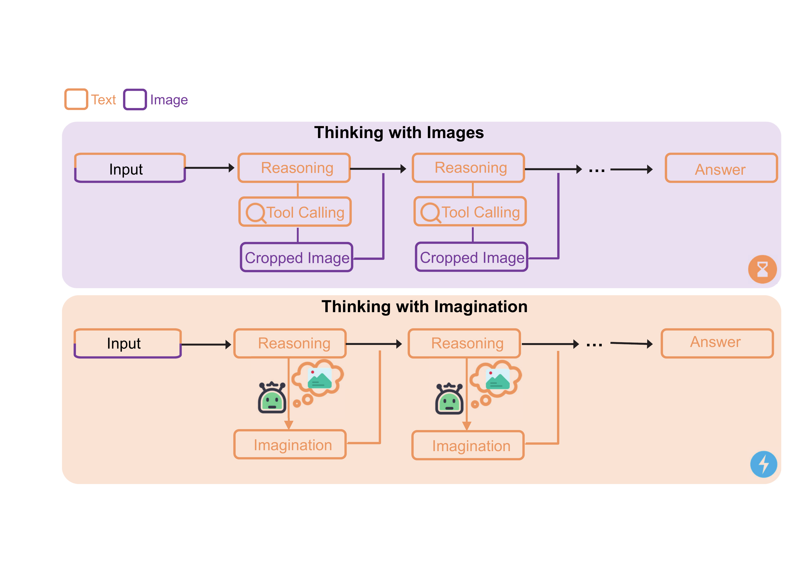

# Imagine-OPD

**Thinking Without Images: Internalizing Visual Manipulation with On-Policy Self-Distillation**

<p align="center">
📃 <a href="https://arxiv.org/abs/2606.08719" target="_blank">Paper</a> |
🤗 <a href="https://huggingface.co/datasets/walkeralan123789/ImagineOPD" target="_blank">Training Dataset</a>
</p>

## News

- **[2026.6.7]** The paper is released on arXiv.
- **[2026.6.7]** The training dataset is released on [Hugging Face](https://huggingface.co/datasets/walkeralan123789/ImagineOPD).
- The model will come soon.

## Overview

Imagine-OPD turns **“Thinking with Images”** into **“Thinking with Imagination”**.

<p align="center">
  
</p>

<p align="center">
  
</p>

## Quick Start

### 1. Environment Setup

The Training Environment

```bash
conda env create -n imagine_train python=3.10
conda activate imagine_train
pip install -r requirements_training.txt
```

The Eval Environment

```bash
conda env create -n imagine_eval python=3.10
conda activate imagine_eval
pip install -r requirements_eval.txt
```

### 2. Prepare Training Data

Download and preprocess the training dataset for EasyR1 training.

The training data should follow the normalized OPD JSON format, where each sample contains student-visible images and teacher-only evidence images:

```json
{
  "messages": [...],
  "images": ["path/or/base64", "..."],
  "teacher_images": [
    "original_path_or_base64",
    "extra_teacher_image_path_or_base64",
    "..."
  ]
}
```

Then, run the following script to convert the normalized OPD JSON file into EasyR1 parquet format:

```bash
python EasyR1/examples/data_preprocess/opd_json.py \
  --input path/to/opd_data.json \
  --save_dir data/opd_json
``` 

This will generate:

```text 
data/opd_json/train.parquet 
```

To prepare the validation data（By default, the script loads V* Bench from Hugging Face.）, run:

```bash 
python EasyR1/examples/data_preprocess/vstar_bench.py \   
  --save_dir data/vstar_bench 
```

This will generate:

```text
data/vstar_bench/test.parquet 
```

### 3. Training

Launch Imagine-OPD training:

```bash
bash EasyR1/examples/imagine_opd.sh
```

Key hyperparameters can be edited at the top of the script. The script is a template: you must set `MODEL_PATH`, `DATA_DIR`, `VAL_DIR`, and optionally `SWANLAB_API_KEY` before running it.

### 4. Merge Checkpoints

After training, merge the  checkpoint into a standard HuggingFace model:

```bash
python EasyR1/scripts/model_merger.py --local_dir YOUR_CHECKPOINT_PATH
```

This merges the FSDP actor shards, saves the model weights, config, tokenizer, and processor into the specified directory. The merged checkpoint can then be loaded directly with `transformers` or served with vLLM.

### 5. Deployment

Serve the merged checkpoint with vLLM, for example:

```bash
vllm serve <path_to_merged_checkpoint> \
    --gpu-memory-utilization 0.85 \
    --tensor-parallel-size 8 \
    --served-model-name Imagine-OPD-4B \
    --trust-remote-code
```

The server listens on port 8000 by default. You can then query the model via the OpenAI-compatible API at `http://localhost:8000/v1/chat/completions`.

### 6. Evaluation

After preparing the evaluation data, run eval/run_vlmevalkit_local.py to evaluate the deployed model with VLMEvalKit.

Each benchmark should be organized as a local JSON file and an image directory, for example:

```text
data/
  vstar/
    data.json
    images/
  hr_bench/
    data.json
    images/
  mme_realworld_lite/
    data.json
    images/
```

The evaluation script will automatically:

1. convert the local data.json into the VLMEvalKit TSV format;
2. generate a temporary VLMEvalKit config file;
3. register the local model and dataset adapters;
4. run VLMEvalKit inference and evaluation.

A typical evaluation command is:

```bash
python eval/run_vlmevalkit_local.py \
  --dataset vstar \
  --data_path data/vstar/data.json \
  --image_dir data/vstar/images \
  --api_config api_config_files/api_config_vlm.json \
  --model_name Imagine-OPD \
  --client_type openai \
  --prompt_template prompt_template/prompt_template_vis.json \
  --prompt imagine \
  --mode all \
  --eval_method rule \
  --api_nproc 8
```

Here, --api_config specifies the OpenAI-compatible API endpoint of the deployed model, and --prompt_template / --prompt specify the prompt template file and the prompt key used for evaluation.

The results will be saved under results/vlmevalkit_<benchmark>_<model_name>_<prompt>/ by default. You can also specify a custom output directory with --work_dir.

## Citation

If you find Imagine-OPD useful for your research, please consider citing:

```bibtex
@misc{cai2026thinkingimagesinternalizingvisual,
      title={Thinking Without Images: Internalizing Visual Manipulation with On-Policy Self-Distillation},
      author={Yishuo Cai and Jiahui Liu and Yuanxin Liu and Haobo Deng and Linli Yao and Yuhao Zheng and Kun Ouyang and Zhimo Li and Ziyue Wang and Xu Sun and Haoli Bai and Xiaohui Li},
      year={2026},
      eprint={2606.08719},
      archivePrefix={arXiv},
      primaryClass={cs.CV},
      url={https://arxiv.org/abs/2606.08719},
}
```
